<h1 align=center>Hydra AI</h1>
<image src="https://mlgktt2y6f.ufs.sh/f/6YinM32zuOKM4ZAHjpG5qeAa6DOTBnZPC9NH78RvV3ho1UiM" alt="Hydra AI Design Preview"/>

  Hydra AI is a revolutionary autonomous DevOps platform that combines advanced AI reasoning with real-time telemetry analysis to detect, diagnose, and resolve infrastructure incidents before they impact your users. Built on TiDB's cutting-edge HTAP architecture, it processes massive telemetry streams while maintaining institutional memory of every incident.

### The Problem

- Mean Time to Recovery (MTTR): 2-8 hours typical
- Downtime Cost: $5.6M per hour on average
- Context Switching: Engineers juggle 15+ tools during incidents
- Knowledge Loss: Solutions forgotten after engineer turnover
- Alert Fatigue: 90% of alerts are noise or false positives

### The Solution

Hydra AI transforms your infrastructure into a self-aware, self-healing system that learns from every incident and gets smarter over time.

### Key Features

**Autonomous AI Agents**

- Context Gathering Agent: Correlates metrics, logs, and traces in real-time
- Pattern Recognition Agent: Finds similar historical incidents using vector search
- Root Cause Analysis Agent: Performs intelligent causal reasoning
- Solution Planning Agent: Generates and validates resolution strategies
- Execution Agent: Safely implements fixes with rollback capabilities

**Institutional Memory**

- Vector-based Incident Search: Semantic matching of error patterns
- Learning System: Every resolution improves future performance
- Knowledge Graphs: Maps service dependencies and failure patterns
- Confidence Scoring: AI rates its own solution certainty

**Real-time Intelligence**

- Sub-second Anomaly Detection: Process 100K+ events per second
- Hybrid Queries: Combine time-series, vector, and full-text search
- Predictive Analytics: Forecast incidents before they happen
- Multi-dimensional Correlation: Connect seemingly unrelated signals

**Safe Automation**

- Gradual Rollouts: Canary deployments for high-risk changes
- Confidence Thresholds: Human approval for uncertain scenarios
- Automatic Rollback: Instant reversion if fixes fail
- Safety Circuits: Multiple layers of protection

## Database Schema

```mermaid

---
config:
  layout: elk
  look: neo
  theme: neo-dark
---
erDiagram
    users {
        VARCHAR id
        VARCHAR clerk_id
        DATETIME created_at
        DATETIME updated_at
        DATETIME deleted_at
    }
    user_preferences {
        VARCHAR id
        VARCHAR user_id
        VARCHAR theme
        VARCHAR timezone
        VARCHAR language
        BOOLEAN show_notification
    }
    organizations {
        VARCHAR id
        VARCHAR name
        VARCHAR description
        VARCHAR avatar_url
        VARCHAR website
        DATETIME created_at
        DATETIME updated_at
        DATETIME deleted_at
    }
    organization_members {
        VARCHAR id
        VARCHAR organization_id
        VARCHAR user_id
        VARCHAR role_id
        DATETIME joined_at
        DATETIME left_at
        VARCHAR granted_by
        DATETIME role_expires_at
    }
    organization_invites {
        VARCHAR id
        VARCHAR organization_id
        VARCHAR sender_id
        VARCHAR recipient_email
        VARCHAR role_id
        VARCHAR status
        VARCHAR message
        DATETIME created_at
        DATETIME updated_at
        DATETIME expires_at
    }
    agents {
        VARCHAR id
        VARCHAR name
        VARCHAR description
        VARCHAR avatar_url
        VARCHAR agent_status
        BOOLEAN is_system
        DATETIME created_at
        DATETIME updated_at
        DATETIME deleted_at
    }
    agent_configs {
        VARCHAR id
        VARCHAR agent_id
        VARCHAR model
        VARCHAR version
        VARCHAR system_prompt
        DATETIME created_at
        DATETIME updated_at
    }
    organization_agents {
        VARCHAR id
        VARCHAR organization_id
        VARCHAR agent_id
        VARCHAR role_id
        VARCHAR status
        DATETIME added_at
        DATETIME removed_at
        DATETIME role_expires_at
    }
    roles {
        VARCHAR id
        VARCHAR organization_id
        VARCHAR name
        VARCHAR description
        BOOLEAN is_default
        BOOLEAN is_system
        INTEGER level
    }
    role_permissions {
        VARCHAR id
        VARCHAR role_id
        VARCHAR action
        DATETIME created_at
    }
    sessions {
        DATETIME created_at
        DATETIME updated_at
        VARCHAR id
        VARCHAR token_jti
        VARCHAR organization_id
        VARCHAR status
        DATETIME expires_at
        DATETIME last_used_at
        VARCHAR ip_address
    }
    revoked_tokens {
        VARCHAR token_jti
        VARCHAR organization_id
        DATETIME revoked_at
        DATETIME expires_at
    }
    metrics {
        VARCHAR id
        INTEGER metric_id
        DATETIME timestamp
        VARCHAR service_name
        VARCHAR metric_name
        FLOAT value
        JSON labels
        VARCHAR unit
        FLOAT anomaly_score
        VARCHAR organization_id
    }
    logs {
        VARCHAR id
        INTEGER log_id
        DATETIME timestamp
        VARCHAR service_name
        VARCHAR level
        TEXT message
        VARCHAR trace_id
        VARCHAR span_id
        JSON structured_data
        VARCHAR embedding
        VARCHAR organization_id
    }
    incidents {
        VARCHAR id
        VARCHAR incident_id
        DATETIME timestamp
        VARCHAR service_name
        VARCHAR severity
        VARCHAR status
        VARCHAR title
        TEXT description
        VARCHAR error_signature
        VARCHAR embedding
        JSON context_data
        JSON resolution_data
        TEXT root_cause
        INTEGER resolution_time_seconds
        FLOAT confidence_score
        BOOLEAN auto_resolved
        VARCHAR organization_id
        VARCHAR assigned_agent_id
    }
    agent_memories {
        DATETIME created_at
        DATETIME updated_at
        VARCHAR id
        VARCHAR incident_id
        VARCHAR agent_id
        VARCHAR memory_type
        JSON content
        VARCHAR embedding
        FLOAT confidence
        INTEGER usage_count
        FLOAT success_rate
        VARCHAR organization_id
    }
    traces {
        VARCHAR id
        VARCHAR trace_id
        VARCHAR span_id
        VARCHAR parent_span_id
        VARCHAR operation_name
        INTEGER start_time
        INTEGER end_time
        FLOAT duration_ms
        VARCHAR status
        JSON attributes
        JSON events
        VARCHAR service_name
        VARCHAR organization_id
    }
    events {
        VARCHAR id
        DATETIME timestamp
        VARCHAR event_type
        VARCHAR source
        VARCHAR severity
        VARCHAR title
        TEXT description
        JSON event_metadata
        VARCHAR organization_id
    }
    agent_execution_logs {
        VARCHAR id
        VARCHAR incident_id
        VARCHAR agent_id
        VARCHAR execution_stage
        VARCHAR action_type
        JSON input_data
        JSON output_data
        INTEGER execution_time_ms
        FLOAT confidence_score
        BOOLEAN success
        TEXT error_message
        DATETIME timestamp
        VARCHAR organization_id
    }
    seed {
        INTEGER id
        VARCHAR name
    }
    user_preferences }o--|| users : "user_id → id"
    organization_members }o--|| users : "user_id → id"
    organization_members }o--|| users : "granted_by → id"
    organization_members }o--|| organizations : "organization_id → id"
    organization_members }o--|| roles : "role_id → id"
    organization_invites }o--|| roles : "role_id → id"
    organization_invites }o--|| users : "sender_id → id"
    organization_invites }o--|| organizations : "organization_id → id"
    agent_configs }o--|| agents : "agent_id → id"
    organization_agents }o--|| organizations : "organization_id → id"
    organization_agents }o--|| roles : "role_id → id"
    organization_agents }o--|| agents : "agent_id → id"
    roles }o--|| organizations : "organization_id → id"
    role_permissions }o--|| roles : "role_id → id"
    sessions }o--|| organizations : "organization_id → id"
    revoked_tokens }o--|| organizations : "organization_id → id"
    metrics }o--|| organizations : "organization_id → id"
    logs }o--|| organizations : "organization_id → id"
    incidents }o--|| agents : "assigned_agent_id → id"
    incidents }o--|| organizations : "organization_id → id"
    agent_memories }o--|| incidents : "incident_id → id"
    agent_memories }o--|| organizations : "organization_id → id"
    agent_memories }o--|| agents : "agent_id → id"
    traces }o--|| organizations : "organization_id → id"
    events }o--|| organizations : "organization_id → id"
    agent_execution_logs }o--|| incidents : "incident_id → id"
    agent_execution_logs }o--|| agents : "agent_id → id"
    agent_execution_logs }o--|| organizations : "organization_id → id"

```

