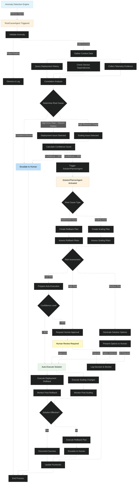

```mermaid
---
config:
  theme: dark
  layout: elk
---
flowchart TB
    A["Anomaly Detection Engine"] -- Distress Signal --> B["RootCauseAgent Triggered"]
    B --> C["Validate Anomaly"]
    C -- False Positive --> D["Dismiss & Log"]
    C -- Valid Anomaly --> E["Gather Context Data"]
    E --> F["Query Deployment History"] & G["Check Service Dependencies"] & H["Collect Telemetry Evidence"]
    F --> I["Correlation Analysis"]
    G --> I
    H --> I
    I --> J{"Determine Root Cause"}
    J -- High Error Rate + Recent Deploy --> K["Deployment Issue Detected"]
    J -- High Resource Usage --> L["Scaling Issue Detected"]
    J -- Complex/Unknown --> M["Escalate to Human"]
    K --> N["Calculate Confidence Score"]
    L --> N
    N -- Confidence > 80% --> O["Trigger SolutionPlannerAgent"]
    N -- Confidence &lt; 80% --> M
    O --> P["SolutionPlannerAgent Activated"]
    P --> Q{"Root Cause Type"}
    Q -- Deployment Issue --> R["Create Rollback Plan"]
    Q -- Scaling Issue --> S["Create Scaling Plan"]
    R --> T["Assess Rollback Risks"]
    S --> U["Assess Scaling Risks"]
    T --> V{"Risk Assessment"}
    U --> V
    V -- High Risk --> W["Request Human Approval"]
    V -- Medium Risk --> X["Generate Solution Options"]
    V -- Low Risk --> Y["Prepare Auto-Execution"]
    W --> Z["Human Review Required"]
    X --> AA["Present Options to Human"]
    Y --> BB{"Confidence Level"}
    BB -- > 90% --> CC["Auto-Execute Solution"]
    BB -- &lt; 90% --> W
    CC --> DD["Execute Deployment Rollback"] & EE["Execute Scaling Changes"]
    Z -- Approved --> CC
    Z -- Rejected --> FF["Log Decision & Monitor"]
    AA -- Option Selected --> CC
    AA -- All Rejected --> FF
    DD --> GG["Monitor Post-Rollback"]
    EE --> HH["Monitor Post-Scaling"]
    GG --> II{"Solution Effective?"}
    HH --> II
    II -- Yes --> JJ["Document Success"]
    II -- No --> KK["Execute Rollback Plan"]
    KK --> LL["Escalate to Human"]
    JJ --> MM["Update Runbooks"]
    LL --> MM
    FF --> MM
    MM --> NN["End Process"]
    D --> NN
    M --> NN
    style A fill:#e1f5fe,color:#424242
    style B fill:#fff3e0,color:#424242
    style M fill:#BBDEFB,color:#000000
    style P fill:#fff3e0,color:#000000
    style Z fill:#fff9c4,color:#000000
    style CC fill:#e8f5e8,color:#000000
```
